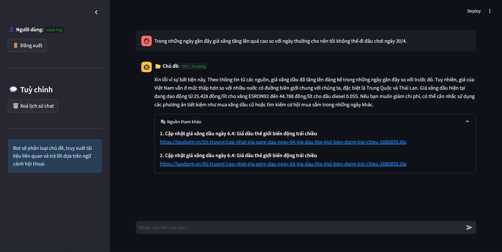

#  Vietnamese NLP and RAG Chatbot using Machine Learning, PhoBERT, FAISS and Ollama

## Overview

This project is a Vietnamese AI chatbot system developed using a Retrieval-Augmented Generation (RAG) architecture. The system combines natural language processing, semantic retrieval, and large language model generation to answer user questions based on stored Vietnamese text documents.

The project pipeline begins with data preprocessing and baseline text classification models using TF-IDF and traditional machine learning algorithms. The system is then improved using PhoBERT for contextual Vietnamese embeddings, FAISS for semantic vector retrieval, and Ollama for local LLM-based response generation.

The system integrates:

* Traditional Machine Learning (TF-IDF + ML models)
* Transformer model (PhoBERT)
* Semantic Search (FAISS)
* Local LLM inference (Ollama)

The chatbot can:

* Classify Vietnamese news
* Retrieve relevant documents
* Generate context-aware answers

## Demo UI



## System Architecture

```text
User Question
      ↓
PhoBERT Embedding
      ↓
FAISS Retrieval
      ↓
Relevant Documents
      ↓
Ollama LLM
      ↓
Generated Response
```

---

## Project Structure

```text
PHO_BERTS/
├── app/                  # Main application source code
│   ├── __pycache__/      # Compiled Python files
│   ├── data/             # Data processing/handling scripts for the app
│   ├── models/           # Model loading or inference modules
│   ├── app.py            # Main entry point for the application GUI/UI
│   ├── build_index.py    # Script for building search or vector indexes
│   ├── llm.py            # Language model integration logic
│   ├── rag.py            # Retrieval-Augmented Generation pipeline
│   └── utils.py          # Helper functions and utilities
│
├── data/                 # Dataset directory
│   ├── processed/        # Cleaned and processed data ready for training
│   ├── raw/              # Original, unmodified data
│   ├── README.md         # Documentation specific to the datasets
│   └── structure_folder.png
│
├── examples/             # Example scripts or usage demonstrations
│   └── test.py           # Testing and verification script
│
├── models/               # Saved machine learning models and encoders
│   ├── label_encoder.pkl # Saved label encoder
│   ├── Logistic Regression.pkl # Trained Logistic Regression model
│   ├── Naive Bayes.pkl   # Trained Naive Bayes model
│   ├── SVM.pkl           # Trained Support Vector Machine model
│   └── README.md         # Documentation for model training and evaluation
│
├── notebooks/            # Jupyter notebooks for EDA and experimentation
│   ├── 00_cleaned_data.ipynb # Data cleaning and preprocessing
│   ├── 01_baseline.ipynb     # Baseline model implementation
│   └── 02_pipeline.ipynb     # Full pipeline and evaluation
│
├── reports/              # Model evaluation reports and summaries
│   └── model_results.csv # CSV file containing model performance metrics
│
├── .gitignore            # Specifies ignored files and folders for Git
├── README.md             # Project overview and documentation
└── requirements.txt      # Dependencies and required Python packages
```


## Methodology

### 1. Baseline Models (Machine Learning)

#### Preprocessing

* Lowercase text
* Remove URLs, HTML tags
* Remove punctuation and numbers
* Normalize whitespace

#### Feature Extraction

* TF-IDF Vectorizer

  * `max_features=5000`
  * `ngram_range=(1,2)`

#### Models

* Logistic Regression
* Support Vector Machine (SVM)
* Multinomial Naive Bayes

---

### 2. PhoBERT Pipeline

#### Model

* `vinai/phobert-base`

#### Processing

* Train / Validation / Test split
* Tokenization (max_length = 256)
* Padding & truncation

#### Training

* HuggingFace Trainer
* Evaluation metrics:

  * Accuracy
  * Precision
  * Recall
  * F1-score

---

### 3️. Semantic Retrieval (FAISS)

- Convert text → embeddings (PhoBERT)
- Store vectors using FAISS
- Retrieve top-k similar documents

---

### 4️. LLM Generation (Ollama)

- Local LLM inference

**Input:**
- User question
- Retrieved documents

**Output:**
- Context-aware response

---

## Results

### Baseline Models Performance

| Model               | Accuracy | Precision | Recall | F1-score |
| ------------------- | -------- | --------- | ------ | -------- |
| Logistic Regression | 0.8323   | 0.8360    | 0.8323 | 0.8319   |
| SVM                 | 0.8562   | 0.8561    | 0.8562 | 0.8553   |
| Naive Bayes         | 0.7796   | 0.7744    | 0.7796 | 0.7637   |

**Best baseline model: SVM**

---

### PhoBERT Performance

| Metric      | Score |
| ----------- | ----- |
| Accuracy    | 0.89  |
| Macro F1    | 0.88  |
| Weighted F1 | 0.89  |

#### Classification Report

```text
              precision    recall  f1-score   support

du_lich         0.83      0.86      0.85        35
kinh_te         0.87      0.81      0.84        59
phap_luat       0.88      0.93      0.90        96
the_gioi        0.94      0.94      0.94       107
the_thao        1.00      0.96      0.98        55
thi_truong      1.00      0.75      0.86         8
thoi_su         0.88      0.62      0.73        58
truyen_hinh     0.96      0.98      0.97        50
van_hoa         0.77      0.85      0.81        20
xa_hoi          0.82      0.93      0.87        80
y_te            0.89      0.97      0.93        58

accuracy                           0.89       626
macro avg       0.90      0.87      0.88       626
weighted avg    0.89      0.89      0.89       626
```

---

## Comparison

| Model               | Accuracy | F1-score |
| ------------------- | -------- | -------- |
| Naive Bayes         | 0.78     | 0.76     |
| Logistic Regression | 0.83     | 0.83     |
| SVM                 | 0.86     | 0.86     |
| **PhoBERT**         | **0.89** | **0.89** |

**PhoBERT outperforms all baseline models**

---

## Observations

* PhoBERT achieves the best overall performance
* Traditional ML models (especially SVM) still perform competitively
* Some classes are harder to classify:

  * `thoi_su` → lower recall (0.62)
  * `thi_truong` → small data (support = 8)
* Transformer model handles semantic context better than TF-IDF

---

## Model Usage

### Load trained model

```python
import joblib

model = joblib.load("models/svm.pkl")
```

### Predict

```python
model.predict(["Tin tức mới về kinh tế Việt Nam"])
```

---

## Key Highlights

* End-to-end NLP system  
* Comparison between Traditional ML and Transformer models  
* Vietnamese NLP processing with PhoBERT  
* Fast semantic search using FAISS  
* Retrieval-Augmented Generation (RAG) pipeline  
* Ready for deployment and real-world usage  

---

## Future Work

* Hyperparameter tuning
* Try PhoBERT-large
* Data augmentation
* Build UI (Streamlit)

---

## Author

* Name: *Phan Trọng Nguyên*

---

## Conclusion

This project demonstrates that:

* Traditional ML models provide strong baselines
* Transformer models like PhoBERT significantly improve performance
* Combining both approaches provides a solid understanding of NLP systems
* RAG architecture enables real-world chatbot applications
